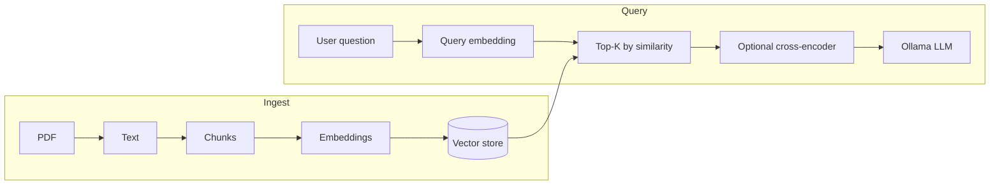

# RAG pipeline: PDF ingest, vector search, optional rerank, Ollama

## How your idea maps to standard RAG

- **Bi-encoder** (`[embedding_model.py](c:\Users\Nikola\Documents\Programiranje\diplomski\back_project\embedding_model.py)`): embed query and chunks **separately**; similarity = cosine / dot product. Fast; good for **first retrieval** over many chunks.
- **Cross-encoder**: one model forward pass per **(query, chunk)** pair; outputs a relevance score. That **is** what people mean by **reranking**: you take **top 50–200** from the bi-encoder, then **resort** those few by cross-encoder scores and keep **top 5–15** for the LLM. You do **not** replace the bi-encoder for the whole corpus (too slow).

So: **yes, a cross-encoder does reranking** in the sense you described; it does **not** replace vector search at scale.

---

## Recommended implementation order

### 1. Stabilize chunking and metadata (small change to `[main.py](c:\Users\Nikola\Documents\Programiranje\diplomski\back_project\main.py)` helpers)

- Keep fixed-size chunks or add **overlap** (e.g. 50–100 chars) so answers are not cut at boundaries; optional later: split on sentences/paragraphs.
- Every chunk should carry **metadata** you will store next to the vector: `document_id`, `chunk_index`, optional `source` (filename), later `page` if you switch to page-aware extraction.

### 2. Ingest service (new module, e.g. `ingest.py` or `rag/ingest.py`)

- Input: PDF bytes + `document_id` (UUID or hash of upload).
- Steps: `extract_text_from_pdf` → `split_into_chunks` → `EmbeddingModel.encode(chunks)`.
- Output: list of records `{ id, document_id, chunk_index, text, embedding }`.

Reuse your existing functions from `[main.py](c:\Users\Nikola\Documents\Programiranje\diplomski\back_project\main.py)` (ideally move PDF/chunk helpers to a small `pdf_utils.py` so FastAPI and ingest both import the same code).

### 3. Vector storage (your “can be done later” — two sane paths)

| Approach                                                                            | When to use                                               |
| ----------------------------------------------------------------------------------- | --------------------------------------------------------- |
| **In-process MVP**: `numpy` matrix + chunk texts in memory or a JSON/SQLite sidecar | One PDF, diploma demo, no extra services                  |
| **Real vector DB**: Chroma, Qdrant (local), LanceDB, or pgvector                    | Multiple documents, persistence, filters by `document_id` |

**Must-haves for the store:** same **embedding model name and dimension** as at query time; store **raw text** with each vector; filter by `document_id` (or collection per upload) so retrieval only searches the right PDF.

### 4. Query / retrieval service

- Embed the question with the **same** `EmbeddingModel` instance and model name as ingest.
- **Retrieve**: cosine / inner product against stored vectors → **top_k** (e.g. 20–100).
- **Optional rerank**: load `CrossEncoder` from `sentence_transformers` (e.g. `cross-encoder/ms-marco-MiniLM-L-6-v2`), score pairs `[(question, chunk_text), ...]`, sort, take **top_n** for context (e.g. 5–12).
- **Build prompt**: system + user message that includes only the **reranked or retrieved** chunk texts (cite chunk index or source in the prompt so the model can refer to “passage 1”, etc.).
- **Call Ollama** (you already have this): POST with the assembled prompt; return answer (+ optional debug: which chunk ids were used).

### 5. FastAPI surface

- **POST** ingest: PDF + optional metadata → chunk, embed, upsert into store (or return embeddings in JSON for the MVP without DB).
- **POST** ask: `{ "question", "document_id", ... }` → retrieve → optional rerank → Ollama → response.

Use **lazy singletons** or `app.state` for `EmbeddingModel` (and `CrossEncoder` if used) so models load once, not per request.

### 6. What you can skip at first

- Cross-encoder: start with **bi-encoder only**; add rerank if answers pick wrong passages.
- Vector DB: start with **numpy + in-memory list** for one document; swap the storage interface later without changing the rest of the pipeline.

---

## Consistency and pitfalls

- **Same model** for indexing and querying for the bi-encoder.
- **Scanned PDFs**: `pypdf` text extraction can be empty; OCR is a separate step if needed.
- **Context limits**: sum of chunk token count must fit the Ollama model window; cap `top_n` or truncate chunks in the prompt.

---

## Summary answer to your question

- `**cosine_similarity` / `rank_by_similarity`**: enough for **retrieval** and small experiments; for production retrieval over many vectors you will mirror the same math inside the vector store (or use `rank_by_similarity`-style logic on a candidate set).
- **Cross-encoder**: use it **after** retrieval to **rerank** a short list; keep bi-encoder + vector DB for the first stage.

